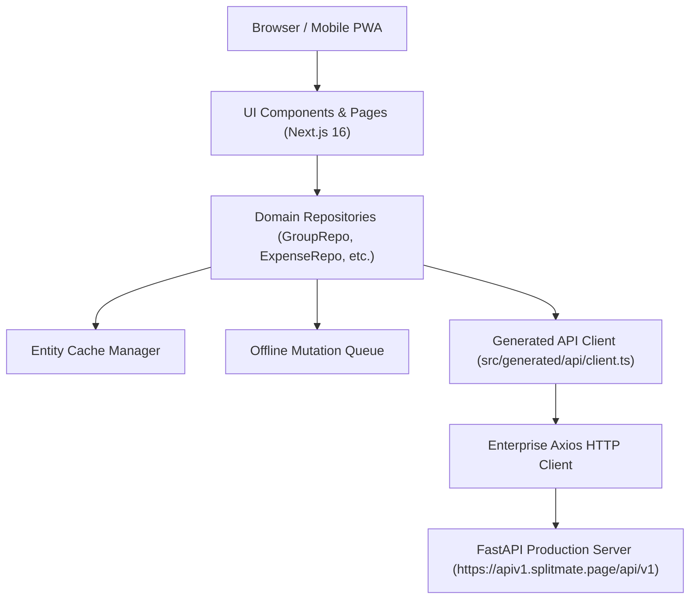
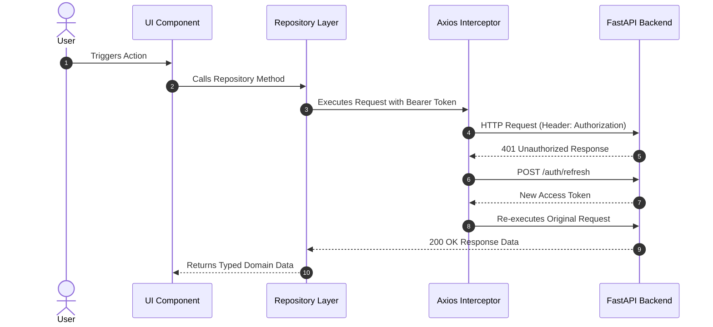
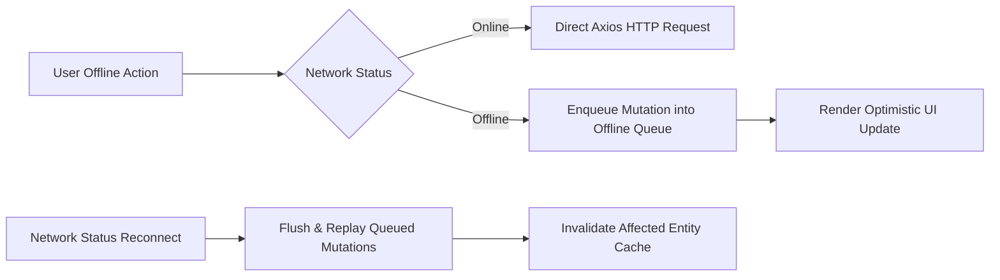

# 🏗️ Splito — System Architecture & Layering Manual

This document presents the complete system architecture, data flow, repository patterns, offline queuing, caching strategies, and rendering architecture for **Splito**.

---

## 📐 High-Level Architecture Diagram

---

## 🏛️ Application Architecture Layers

1. **Presentation Layer (`src/app/`, `src/components/`)**:
   - Next.js 16 App Router using React Server Components (RSC) and Client Boundaries (`'use client'`).
   - Styled using Tailwind CSS v4 and the **Neo-Clay Surface Tokens**.
2. **Domain Repository Layer (`src/features/*/repositories/`)**:
   - Encapsulates data fetching and mutation logic. UI components consume domain Repositories (`GroupRepository`, `ExpenseRepository`, `BalanceRepository`, `SettlementRepository`), hiding API details.
3. **Entity Cache & Offline Engine (`src/lib/cache/`, `src/lib/offline/`)**:
   - In-memory entity caching with tag invalidations and IndexedDB mutation queue replay when connectivity recovers.
4. **Generated OpenAPI API Client (`src/generated/api/`)**:
   - Auto-generated TypeScript types and client wrapping Axios instance (`src/lib/axios.ts`).

---

## 🔄 Authentication & Refresh Queue Flow

---

## 📶 Offline Sync & PWA Architecture

